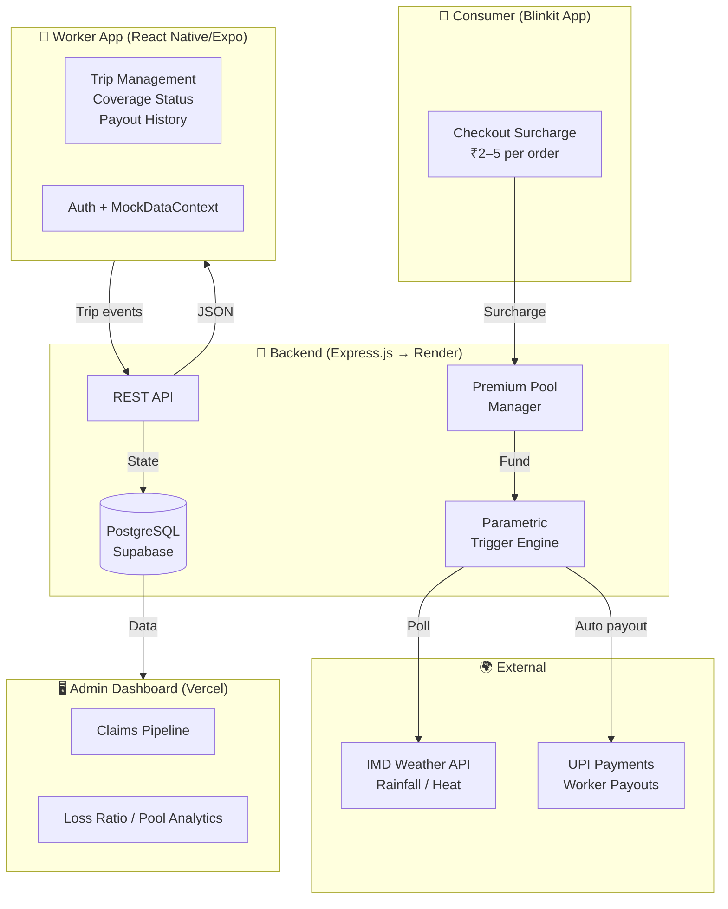

# QuickCover 🛡️
### AI-Powered Parametric Income Protection for India's Gig Economy

> *Submitted to Guidewire DEVTrails 2026: Unicorn Chase*

---

## The Problem

India's 15 million+ gig delivery workers power the Q-commerce economy — but have zero financial
protection when it breaks down around them.

When a sudden flood, extreme heat, or unplanned curfew halts operations, it isn't the platform
that suffers — it's the worker. A single disrupted day erases **₹400–₹650 of net income**
(20–30% of a monthly take-home of ₹10k–₹20k), with no recourse, no claim process, no safety net.

These are not personal failures. They are **systemic, measurable, external events** — and yet
workers bear the entire financial cost alone.

**Blinkit and other platforms already spend ₹100 crore+ annually on partner insurance** — but
it only covers accidents and hospitalisation. Nobody covers income lost to weather, outages, or
zone disruptions. That is the gap QuickCover fills.

---

## The Solution

**QuickCover** is a consumer-funded parametric income protection platform for Q-commerce delivery
partners (Blinkit, Zepto, Swiggy Instamart).

### The Core Insight: The Driver Pays Nothing

Protection is funded entirely by a **micro-surcharge on the consumer's order** — ₹2–5 per order,
less than the cost of a single Mentos. The consumer opts in at checkout ("Protect your delivery
partner — ₹3"). The pool pays drivers automatically when a verified disruption hits.

```
Consumer places ₹500 order → ₹3 surcharge added at checkout
              ↓
Worker accepts the order → Coverage activates for that trip
              ↓
External disruption detected (heavy rain / outage / curfew)
              ↓
AI verifies: worker GPS + platform logs + trigger event data
              ↓
Payout auto-credited → Worker's UPI wallet, synced to weekly settlement
```

No claims. No paperwork. No cost to the driver — ever.

---

## Financial Model at a Glance

### Consumer Micro-Charge (AI Variable)

| Order Value | Surcharge | As % of Order |
|---|---|---|
| ₹100–₹300 | ₹2 | 0.7–2% |
| ₹300–₹700 | ₹3 | 0.4–1% |
| ₹700–₹1,500 | ₹5 | 0.3–0.7% |

The AI engine adjusts the surcharge in real time based on: weather risk, zone disruption history,
active driver shortage, time of day, and current pool balance.

### Payout Triggers (Parametric — Automatic)

| Trigger | Condition | Driver Payout |
|---|---|---|
| Heavy rain | IMD: >15mm/hr in zone | ₹300–500/shift |
| Extreme heat | >43°C for 2+ hrs | ₹250–400/shift |
| Platform outage | Zone unavailable >90 mins | ₹200–350 |
| Lockdown / curfew | Govt. notification | ₹500–700/day |

### Unit Economics (10% Rollout)

| Metric | Value |
|---|---|
| Blinkit orders/day (India) | ~750,000–1,000,000 |
| Avg surcharge per order | ₹3 |
| Monthly pool inflow (10%) | ₹6.7Cr–₹9Cr |
| Monthly driver payouts | ₹1.75Cr–₹3.5Cr |
| Loss ratio | ~30–50% (target 55–65%) |
| QuickCover platform margin | 15–20% of pool |

Break-even at **~2–3% of Blinkit's daily order volume** participating.

See [FINANCIAL_MODEL.md](FINANCIAL_MODEL.md) for the full model.

---

## System Architecture



### Key Design Principles

| Principle | Implementation |
|---|---|
| **Zero cost to driver** | 100% consumer-funded via per-order surcharge |
| **Trip-level granularity** | Coverage is per-trip, not monthly — no gaps, no over-insurance |
| **Parametric payouts** | No manual claims — objective, verifiable data triggers |
| **AI variable pricing** | Surcharge adjusts real-time to weather, zone risk, pool balance |
| **Fraud prevention** | GPS cross-referencing + trip log validation |

---

## Tech Stack

| Layer | Technology |
|---|---|
| Mobile (Worker) | React Native / Expo |
| Web (Admin) | React + Vite / Vercel |
| Backend | Node.js / Express → Render |
| Database | PostgreSQL / Supabase |
| Trigger APIs | IMD Weather, Google Maps Platform |
| Payments | Razorpay / UPI (Phase 2) |

---

## Repo Structure

```
QuickCover/
├── mobile/          # React Native (Expo) — worker-facing app
├── mock-backend/    # Express.js API server
├── admin/           # Vite admin dashboard
├── FINANCIAL_MODEL.md  # Full financial model & research
└── README.md
```

---

## Running Locally

### Backend
```bash
cd mock-backend
npm install
npm start
# API at http://localhost:4000
```

### Mobile App
```bash
cd mobile
npm install
npx expo start
# Press 'a' for Android emulator, scan QR for Expo Go
```

### Admin Dashboard
```bash
cd admin
npm install
npm run dev
```

---

## Cloud Deployment

| Service | Platform | URL |
|---|---|---|
| Backend API | Render | https://quickcover.onrender.com |
| Admin Dashboard | Vercel | https://quick-cover-neon.vercel.app |
| Database | Supabase | PostgreSQL (pooler, ap-northeast-2) |

---

## Why This Wins

- **Real market need** — 15M+ underserved workers, ₹6,000–₹12,000/year of income at risk per worker
- **Zero friction adoption** — driver pays nothing; consumers already accept small surcharges
- **Scalable unit economics** — ₹3/order creates a self-sustaining pool; break-even at 2–3% participation
- **Parametric = fast + fraud-resistant** — no adjusters, no disputes, automatic payouts
- **Platform-neutral** — works across Blinkit, Zepto, Swiggy via webhook integration
- **Regulatory-ready** — fits IRDAI's micro-insurance sandbox; no own license required initially

---

*QuickCover covers strictly verified loss of income from parametric disruption triggers.
It does not cover health, vehicle damage, or life events.*
