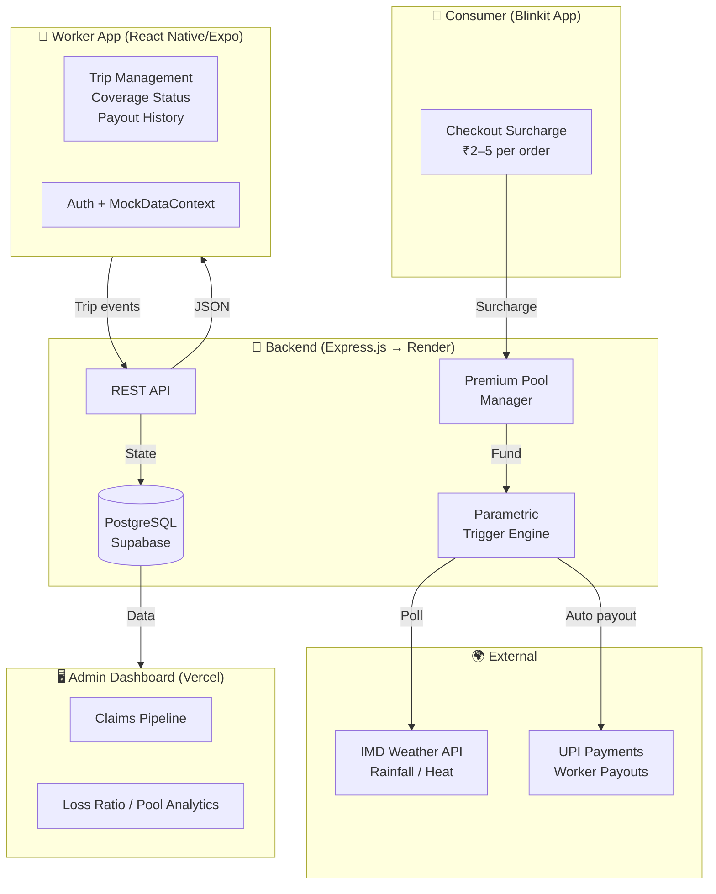

# QuickCover 🛡️

### AI-Powered Parametric Income Protection for India's Gig Economy

> *Submitted to Guidewire DEVTrails 2026: Unicorn Chase*

---

## 📑 Table of Contents

- [Overview](#-overview)
- [The Problem](#-the-problem)
- [The Solution](#-the-solution)
  - [How It Works](#how-it-works)
  - [Core Insight](#core-insight)
- [Financial Model](#-financial-model)
  - [Consumer Micro-Charge](#consumer-micro-charge-ai-variable)
  - [Payout Triggers](#payout-triggers-parametric--automatic)
  - [Unit Economics](#unit-economics-10-rollout)
- [System Architecture](#-system-architecture)
  - [Architecture Diagram](#architecture-diagram)
  - [Design Principles](#key-design-principles)
- [Tech Stack](#-tech-stack)
- [Repository Structure](#-repository-structure)
- [Security & Fraud Prevention](#-security--fraud-prevention)
  - [Anti-Spoofing Strategy](#adversarial-defense--anti-spoofing-strategy)
  - [Three-Pillar Defense](#three-pillar-defense)
- [Getting Started](#-getting-started)
  - [Local Development](#local-development)
  - [Cloud Deployment](#cloud-deployment)
- [Disclaimer](#-disclaimer)

---

## 🎯 Overview

**QuickCover** is a consumer-funded parametric income protection platform designed specifically for India's Q-commerce delivery workforce. It protects 15 million+ gig workers from income loss due to external disruptions like extreme weather, platform outages, and lockdowns — with **zero cost to the worker**.

**Key Stats:**
- 🚴 **15M+ workers** in India's gig delivery economy
- 💰 **₹400–650** net income lost per disrupted day
- 🏢 **₹100Cr+** spent annually by platforms on partner insurance
- ⚡ **₹2–5** consumer surcharge per order (100% funds worker protection)

---

## 🔴 The Problem

India's 15 million+ gig delivery workers power the Q-commerce economy — but have **zero financial protection** when it breaks down around them.

### The Gap in Coverage

When a sudden flood, extreme heat, or unplanned curfew halts operations, it isn't the platform that suffers — **it's the worker**.

**Impact per worker:**
- 💸 **₹400–₹650** lost per disrupted day
- 📊 **20–30%** of monthly take-home (₹10k–₹20k)
- 🚫 **No recourse**, no claim process, no safety net

### What Existing Insurance Covers

**Blinkit and other platforms already spend ₹100 crore+ annually on partner insurance** — but it only covers:
- ✅ Accidents
- ✅ Hospitalization
- ❌ **NOT** income lost to weather, outages, or zone disruptions

These are not personal failures. They are **systemic, measurable, external events** — and yet workers bear the entire financial cost alone.

**That gap is what QuickCover fills.**

---

## ✅ The Solution

**QuickCover** is a consumer-funded parametric income protection platform for Q-commerce delivery partners (Blinkit, Zepto, Swiggy Instamart).

### Core Insight

> **The Driver Pays Nothing**

Protection is funded entirely by a **micro-surcharge on the consumer's order** — ₹2–5 per order, less than the cost of a single Mentos. 

The consumer opts in at checkout:
> *"Protect your delivery partner — ₹3"*

The pool pays drivers automatically when a verified disruption hits.

### How It Works

```
Consumer places ₹500 order → ₹3 surcharge added at checkout
              ↓
Worker accepts the order → Coverage activates for that trip
              ↓
External disruption detected (heavy rain / outage / curfew)
              ↓
AI verifies: worker GPS + platform logs + trigger event data
              ↓
Payout auto-credited → Worker's UPI wallet, synced to weekly settlement
```

**No claims. No paperwork. No cost to the driver — ever.**

---

## 💰 Financial Model

### Consumer Micro-Charge (AI Variable)

The surcharge adjusts in real-time based on risk factors:

| Order Value | Surcharge | As % of Order |
|-------------|-----------|---------------|
| ₹100–₹300   | ₹2        | 0.7–2%        |
| ₹300–₹700   | ₹3        | 0.4–1%        |
| ₹700–₹1,500 | ₹5        | 0.3–0.7%      |

**AI Variables:**
- 🌧️ Weather risk
- 📍 Zone disruption history
- 👥 Active driver shortage
- ⏰ Time of day
- 💵 Current pool balance

---

### Payout Triggers (Parametric — Automatic)

| Trigger | Condition | Driver Payout |
|---------|-----------|---------------|
| 🌧️ **Heavy rain** | IMD: >15mm/hr in zone | ₹300–500/shift |
| 🔥 **Extreme heat** | >43°C for 2+ hrs | ₹250–400/shift |
| 🔌 **Platform outage** | Zone unavailable >90 mins | ₹200–350 |
| 🚫 **Lockdown/curfew** | Govt. notification | ₹500–700/day |

---

### Unit Economics (10% Rollout)

| Metric | Value |
|--------|-------|
| Blinkit orders/day (India) | ~750,000–1,000,000 |
| Avg surcharge per order | ₹3 |
| **Monthly pool inflow (10%)** | **₹6.7Cr–₹9Cr** |
| Monthly driver payouts | ₹1.75Cr–₹3.5Cr |
| **Loss ratio** | **30–50%** (target: 55–65%) |
| QuickCover platform margin | 15–20% of pool |

**Break-even:** ~2–3% of Blinkit's daily order volume participating.

📄 See [FINANCIAL_MODEL.md](FINANCIAL_MODEL.md) for the full model.

---

## 🏗️ System Architecture

### Architecture Diagram


---

### Key Design Principles

| Principle | Implementation |
|-----------|----------------|
| **💸 Zero cost to driver** | 100% consumer-funded via per-order surcharge |
| **🎯 Trip-level granularity** | Coverage is per-trip, not monthly — no gaps, no over-insurance |
| **⚡ Parametric payouts** | No manual claims — objective, verifiable data triggers |
| **🤖 AI variable pricing** | Surcharge adjusts real-time to weather, zone risk, pool balance |
| **🔒 Fraud prevention** | GPS cross-referencing + trip log validation |

---

## 🛠️ Tech Stack

| Layer | Technology |
|-------|------------|
| **📱 Mobile (Worker)** | React Native / Expo |
| **🌐 Web (Admin)** | React + Vite / Vercel |
| **⚙️ Backend** | Node.js / Express → Render |
| **🗄️ Database** | PostgreSQL / Supabase |
| **🌍 Trigger APIs** | IMD Weather, Google Maps Platform |
| **💳 Payments** | Razorpay / UPI (Phase 2) |

---

## 📁 Repository Structure

```
QuickCover/
├── 📱 mobile/              # React Native (Expo) — worker-facing app
│   ├── src/
│   ├── app.json
│   └── package.json
│
├── ⚙️ mock-backend/        # Express.js API server
│   ├── server.js
│   ├── routes/
│   └── package.json
│
├── 🖥️ admin/              # Vite admin dashboard
│   ├── src/
│   ├── index.html
│   └── package.json
│
├── 📊 FINANCIAL_MODEL.md  # Full financial model & research
├── 📖 README.md           # This file
└── 📄 LICENSE
```

---

## 🔒 Security & Fraud Prevention

### Adversarial Defense & Anti-Spoofing Strategy

QuickCover's parametric model pays out automatically — which means **GPS spoofing is a primary fraud vector**. 

A bad actor could fake their location to appear inside a disruption zone and claim a payout without being genuinely affected.

### Three-Pillar Defense

---

#### **Pillar 1: AI/ML Architecture — Behavioral Anomaly Detection**

The system moves beyond checking raw GPS coordinates. The AI flags **impossible physics** in the data:

| Detection Method | What It Catches |
|------------------|-----------------|
| **🚫 Teleportation detection** | A worker cannot jump 5 km between two GPS pings 30 seconds apart. Velocity-based filtering catches spoofed location jumps instantly. |
| **📊 Clustering anomalies** | During a real storm, hundreds of workers will have GPS coordinates that *drift naturally* due to movement and signal noise. A spoofing attack produces unnaturally identical or static coordinates across many accounts from the same zone. |
| **🗺️ Context-aware movement analysis** | The AI analyzes whether movement patterns are consistent with navigating flooded roads (slower speeds, detours, stops) versus a static device with a spoofed location. |

---

#### **Pillar 2: Data — Beyond Basic GPS Coordinates**

GPS alone is insufficient. The system cross-verifies using **three secondary signals**:

| Signal | Method | What It Catches |
|--------|--------|-----------------|
| **📱 OS-Level Mock Location Flags** | Android `isProviderEnabled('test')` flag; iOS perfect-accuracy anomaly (0m error) | Third-party spoofing apps (Fake GPS, Mock Location) active on device |
| **📡 Network Triangulation & IP Data** | Match GPS coordinates against cell tower IDs and Wi-Fi IP geolocation | GPS placed in Zone A while device connects via cell tower in Zone C |
| **📳 Telematics & Device Sensors** | Accelerometer + gyroscope confirm physical movement: bumps, turns, stops consistent with route navigation | Stationary device with animated GPS path |

---

#### **Pillar 3: UX Balance — Quarantine & Deferred Payout**

Heavy rain causes natural network drops — automatically denying flagged claims would harm honest workers. 

Instead, QuickCover uses a **Quarantine & Deferred Payout** workflow:

```
1. 🚩 Flag, don't deny
   Suspicious claims are marked "Pending Review", not rejected.

2. ⏳ Wait for connectivity
   Once the worker's network stabilizes (post-storm), the app sends a push notification.

3. 📸 Low-friction secondary verification
   The worker is prompted to take a single live, timestamped photograph:
   - A flooded street
   - A closed store shutter
   - A police cordon

4. ✅ AI photo review
   The image is processed for authenticity (timestamp, geotag, scene content).
   Matching photos trigger immediate fund release.
```

**This approach:**
- ✅ Eliminates false positives caused by infrastructure failures
- ✅ Maintains strong fraud resistance against deliberate spoofing
- ✅ Preserves worker trust and UX

---

## 🚀 Getting Started

### Local Development

#### **Backend API**

```bash
cd mock-backend
npm install
npm start
# API running at http://localhost:4000
```

---

#### **Mobile App (Worker)**

```bash
cd mobile
npm install
npx expo start

# Options:
# - Press 'a' for Android emulator
# - Press 'i' for iOS simulator
# - Scan QR code with Expo Go app
```

---

#### **Admin Dashboard**

```bash
cd admin
npm install
npm run dev
# Open http://localhost:5173
```

---

### Cloud Deployment

| Service | Platform | URL |
|---------|----------|-----|
| **Backend API** | Render | https://quickcover.onrender.com |
| **Admin Dashboard** | Vercel | https://quick-cover-neon.vercel.app |
| **Database** | Supabase | PostgreSQL (pooler, ap-northeast-2) |

---

| Factor | Impact |
|--------|--------|
| **🎯 Real market need** | 15M+ underserved workers, ₹6,000–₹12,000/year of income at risk per worker |
| **⚡ Zero friction adoption** | Driver pays nothing; consumers already accept small surcharges |
| **📈 Scalable unit economics** | ₹3/order creates a self-sustaining pool; break-even at 2–3% participation |
| **🤖 Parametric = fast + fraud-resistant** | No adjusters, no disputes, automatic payouts |
| **🔌 Platform-neutral** | Works across Blinkit, Zepto, Swiggy via webhook integration |
| **✅ Regulatory-ready** | Fits IRDAI's micro-insurance sandbox; no own license required initially |

---

## ⚠️ Disclaimer

QuickCover covers **strictly verified loss of income from parametric disruption triggers**.

**It does NOT cover:**
- ❌ Health
- ❌ Vehicle damage
- ❌ Life events
- ❌ Personal accidents (covered by existing platform insurance)

---

<div align="center">

**Built with ❤️ for India's gig economy workers**

[⭐ Star this repo](https://github.com/quickcover) | [🐛 Report Bug](https://github.com/quickcover/issues) | [💡 Request Feature](https://github.com/quickcover/issues)

</div>